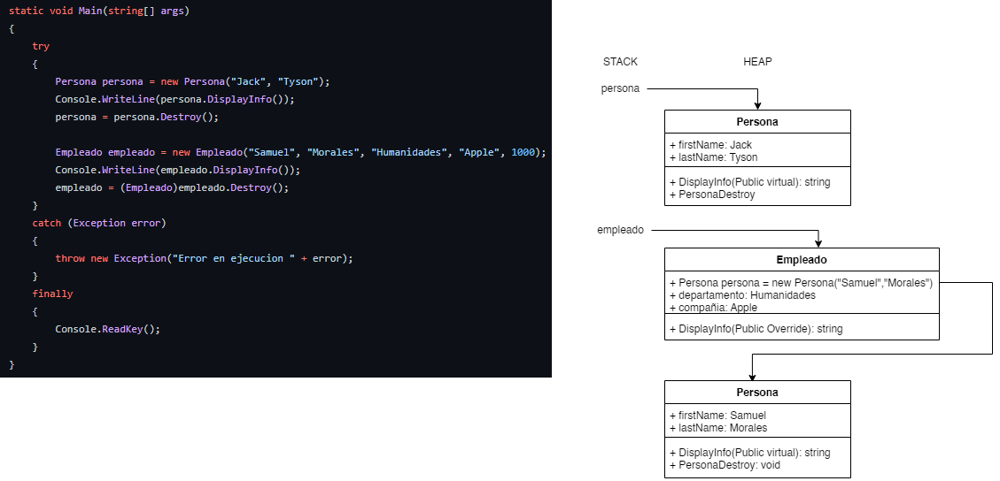
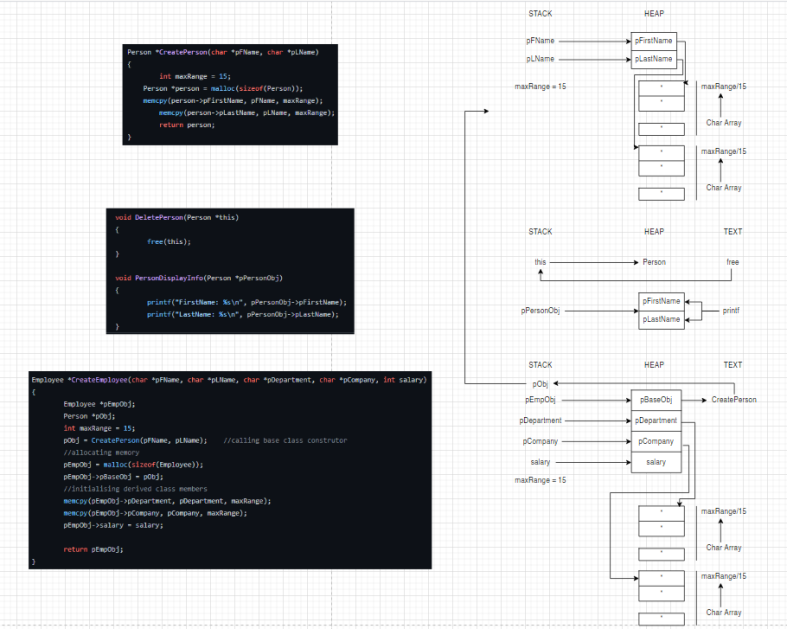
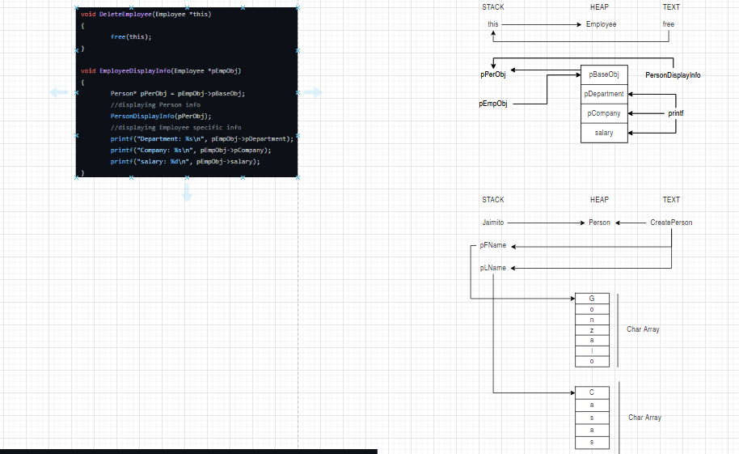
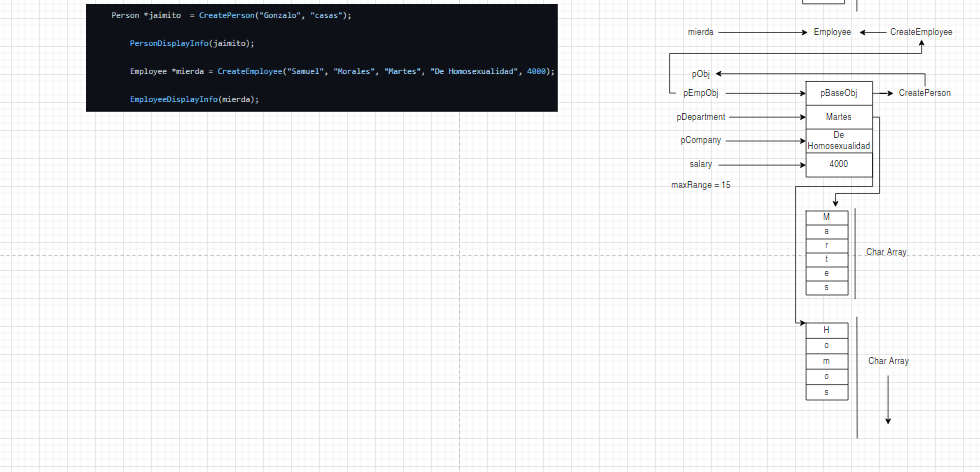
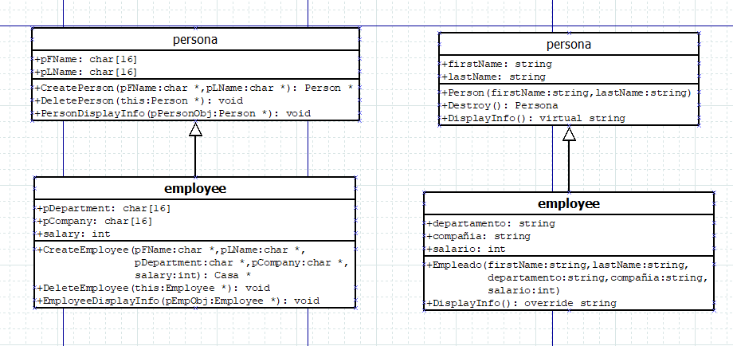

Link del video:
https://youtu.be/Vg8zqFhcKqc

Repositorios:
https://github.com/Menguiza/PloymorphismInC
https://github.com/Menguiza/PolymorphismInCSharp

Estudiantes:
Daniel Hoyos
Julian Arroyave
